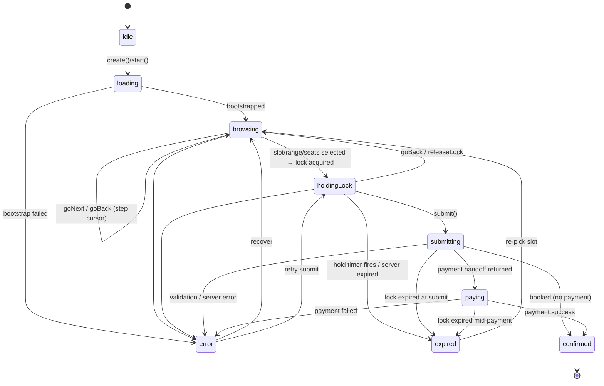

# Headless Wizard Core — M1 Design

**Status:** Draft for review (M1 of the Vanilla JS Wizard PRD)
**Target release:** Booked 1.3.0
**Scope of this doc:** the framework-free **core** only — state machine, public API, event catalog, i18n table, soft-lock + hold timer, stale-response handling, and the versioned endpoint map. The vanilla renderer (M2), the accessible calendar, the payment gateway module, and deprecation plumbing are out of scope here and referenced only where they constrain the core's contract.

This design covers **both** the booking flow and the event flow (plus event-management mode) from day one, per the M1 decision — so the event renderer in M2.5 needs no core refactor.

---

## 1. Goals recap (core-level)

The core is the semver'd, zero-dependency brain that any frontend drives:

1. **Zero runtime dependencies**, no `eval`/`new Function`, no DOM assumptions. Runs headless (Node/tests) or behind any renderer.
2. **Explicit, testable state machine** — replaces today's implicit Alpine reactive state and the hand-written `nextStep` / `getPreviousStep` / `shouldSkipEmployeeStep` split that is the source of back-nav and lock-expiry edge-case bugs.
3. **One flow engine, two flows** — booking and event flows are *data* (step definitions + endpoint bindings), not forked code.
4. **Events over overrides** — every meaningful transition emits; the renderer is just the first consumer, which proves the headless contract.
5. **First-class soft-lock with a hold timer** — the current wizard has *no* client-side countdown and only discovers an expired lock at submit. The core owns the timer and emits `lock:expiring` / `lock:expired`.

### Non-goals for the core

- No templating, no reactivity system, no virtual DOM. Anything reactive/templating-shaped belongs in the renderer and is rejected in core review (PRD risk: "framework of our own").
- No calendar UI. The core exposes availability *data*; the accessible calendar grid is a renderer concern (M2/M3).
- No gateway SDKs. The core exposes a `paying` state and a `payment:mount` payload; gateway modules mount separately (M3 / Direct Payments PRD).

---

## 2. Architecture & file layout

```
src/web/js/core/
  index.js            — public entry: BookedWizard.create(), BookedWizard.version
  machine.js          — the lifecycle state machine (states, guarded transitions)
  flow.js             — flow-step engine: ordered steps + visibility predicates (replaces nextStep/getPreviousStep)
  flows/
    booking.js        — booking flow definition (7 steps) + data bindings
    event.js          — event flow definition (3 steps) + management-mode sub-machine
  api.js              — versioned API client (/actions/booked/api/v1/...), CSRF, site param, request cancellation
  lock.js             — soft-lock lifecycle + hold timer (single auto-extend, expiry emit)
  emitter.js          — tiny event emitter (on/off/once/emit)
  i18n.js             — string table + interpolation, English fallbacks
  validation.js       — field validators (email, phone-required, quantity bounds) — pure functions
  context.js          — the wizard context object (selection state, computed getters)
```

**Build output** (per open-question #1 → *two source files, one bundle*):
- `booked-wizard-core.js` — everything under `core/`, shipped as **ESM + UMD**. This is the headless build.
- `booked-wizard-ui.js` (M2) — the renderer, depends only on the core's public API.
- Asset bundle concatenates core + UI for the default include; headless consumers load core alone.

Budget: core + UI gzipped **< 25 KB** (PRD success metric). Core alone is expected ~8–10 KB gzipped.

---

## 3. The state machine

Two dimensions kept deliberately separate — conflating them is what makes the Alpine version fragile:

- **Lifecycle state** — *what phase the booking is in* (finite, guarded).
- **Step cursor** — *which visible step the user is on* within the browsing phase (derived from the flow definition, never hand-maintained).

### 3.1 Lifecycle states

| State | Meaning | Can transition to |
|---|---|---|
| `idle` | Created, not yet bootstrapped | `loading` |
| `loading` | Bootstrapping (services/commerce settings, deep-link resolve) | `browsing`, `error` |
| `browsing` | Moving through flow steps; no lock held | `holdingLock`, `browsing` (step change), `error` |
| `holdingLock` | A soft-lock (slot / multi-day / event seats) is held; hold timer running | `browsing` (back / release), `submitting`, `expired`, `error` |
| `submitting` | `create-booking` in flight | `confirmed`, `paying`, `expired`, `error` |
| `paying` | Reservation created, gateway/redirect handoff in progress | `confirmed`, `expired`, `error` |
| `confirmed` | Booking complete (success step) | *(terminal, `reset()` → `idle`)* |
| `expired` | Lock expired before completion | `browsing` (re-pick slot), *(terminal-ish)* |
| `error` | Recoverable error surfaced | `browsing`, `holdingLock` (retry) |

Notes:
- `paying` is entered **only** when `create-booking` returns a payment handoff (Commerce `redirectUrl` today; a gateway `payment:mount` payload once Direct Payments lands). Pure free bookings go `submitting → confirmed`.
- `expired` is reachable from `holdingLock`, `submitting`, and `paying` — the hold timer or a server `410/expired` response fires it. From `expired` the user returns to the date/time step with selection cleared for that slot.

### 3.2 State chart



### 3.3 Step cursor (flow engine)

The step order and skip rules become **data**, eliminating the forward/back duplication. Each flow defines an ordered list of steps, each with a `visible(ctx)` predicate:

```js
// flows/booking.js (illustrative)
export const bookingFlow = {
  id: 'booking',
  steps: [
    { id: 'service',   visible: () => true },
    { id: 'extras',    visible: ctx => ctx.extras.length > 0 },
    { id: 'location',  visible: ctx => ctx.locations.length > 1 },
    { id: 'employee',  visible: ctx => ctx.employees.length > 0 && !ctx.serviceHasSchedule },
    { id: 'datetime',  visible: () => true },
    { id: 'info',      visible: () => true },
    { id: 'review',    visible: () => true },
    // 'success' is the `confirmed` lifecycle state, not a flow step
  ],
};
```

`goNext()` / `goBack()` walk to the next/previous step whose `visible(ctx)` is true — a **single source of truth** for both directions. Auto-selection side effects (single location/employee) are handled by the data-load steps setting context, not by the navigation logic. This retires `getPreviousStep()` (the reverse state machine) and the `querySelector('[x-show*="step === 5"]')` focus hack.

Event flow (`flows/event.js`): steps `event → info → review`; management mode is a distinct entry that skips the booking flow entirely (see §3.4).

### 3.4 Event-management sub-machine

Reached via `?manage=<token>` — orthogonal to the booking lifecycle. Small dedicated machine:

```
managing.idle → managing.loaded → { cancel | reduceQty | increaseQty } → managing.done | managing.error
```

Exposed through the same public API surface (`BookedWizard.create({ mode: 'manage', token })`) so a renderer treats it uniformly. It reuses `api.js` and the emitter; it does **not** touch the lock/hold machinery.

### 3.5 Deep-linking

`start()` resolves URL params (`serviceId, locationId, employeeId, date, time`, `?waitlist=`, `?manage=`) and jumps the cursor to the deepest step whose prerequisites resolve — replicating today's `init()` behavior, but as an explicit `resolveDeepLink(ctx) → stepId` function that returns a target step rather than imperatively mutating during load. If `time` is present, it acquires a lock (→ `holdingLock`) after bootstrap.

---

## 4. Public API (semver stability contract)

Everything in this section is the **committed** surface. Additions are minor-version; removals/renames are major (2.0).

### 4.1 Construction

```js
const wizard = BookedWizard.create({
  mount: '#booking',      // renderer target; omit for headless
  mode: 'book',           // 'book' | 'manage'   (default 'book')
  flow: 'booking',        // 'booking' | 'event' (default inferred from template/config)
  serviceId: 12,          // optional preselects (booking)
  eventDateId: 34,        // optional preselect (event)
  locationId, employeeId, date, time,  // optional deep-link seeds
  conversionToken: '…',   // waitlist-conversion prefill (book mode)
  manageToken: '…',       // reservation token (manage mode)
  locale: 'de',
  labels: { /* same keys as today's Twig config */ },
  config: { /* toggles: requirePhone, showNotes, defaultQuantity, captcha…, honeypot… */ },
  api: { baseUrl: '/actions/booked/api/v1', csrf: { name, value }, site: 'default' },
});

BookedWizard.version; // semver string, e.g. "1.0.0" (core contract version, independent of plugin version)
```

`create()` does not auto-start. `await wizard.start()` bootstraps (loading → browsing). This lets a headless consumer attach listeners before any network call.

### 4.2 Instance methods

| Method | Purpose |
|---|---|
| `start()` → `Promise` | Bootstrap: load services/commerce settings, resolve deep link. |
| `getState()` | `{ lifecycle, stepId, context }` snapshot (immutable copy). |
| `goNext()` / `goBack()` | Move the step cursor to the next/prev visible step. Guarded — throws/no-ops if invalid. |
| `selectService(id)` | Programmatic selection; triggers dependent data loads. Headless driving. |
| `selectExtra(id, qty)` / `clearExtra(id)` | Add-ons. |
| `selectLocation(id)` / `selectEmployee(id)` | — |
| `selectSlot({ date, time, quantity })` | Booking slot → acquires lock → `holdingLock`. |
| `selectRange({ startDate, endDate, quantity })` | Multi-day → multi-day lock. |
| `selectEventDate(id, { quantity })` | Event flow → event lock. |
| `setCustomer({ name, email, phone, notes })` | Collecting-info fields. |
| `submit()` | Validate + `create-booking`. → `confirmed` / `paying` / `expired` / `error`. |
| `releaseLock()` | Explicit release (also auto-called on back-nav, expiry, destroy, `beforeunload`). |
| `joinWaitlist({ … })` | Waitlist entry (booking or event). |
| `manage.cancel()` / `manage.reduce(qty)` / `manage.increase(qty)` | Management mode. |
| `reset()` | Back to `idle` (post-confirmation "book another"). |
| `destroy()` | Release lock, clear timers, remove listeners. |

All async methods return promises and never throw for *expected* domain errors (validation, expired lock, capacity) — those surface as `error` / `expired` states and `error` events. Promises reject only for programmer errors (bad arguments).

### 4.3 Computed getters (read-only)

Exposed so a renderer never re-derives pricing/duration (which caused the label split-brain):

`totalPrice`, `extrasTotal`, `extrasDuration`, `requiresPayment`, `canProceed` (per current step), `currentStep`, `visibleSteps`, `lockRemainingMs`, `isDayService`, `isFlexibleDayService`.

---

## 5. Event catalog

Emitted via `wizard.on(name, handler)` / `off` / `once`. Payloads are plain objects (structured-clone-safe).

| Event | Payload | When |
|---|---|---|
| `state:change` | `{ from, to, stepId }` | Any lifecycle transition. |
| `step:change` | `{ from, to, direction }` | Step cursor moves. Renderer swaps step + moves focus. |
| `data:loaded` | `{ kind, items }` | services / extras / employees / locations / slots / eventDates arrived (post stale-guard). |
| `slot:selected` | `{ date, time, quantity }` | — |
| `range:selected` | `{ startDate, endDate, quantity }` | Multi-day. |
| `lock:acquired` | `{ token, expiresAt }` | Soft-lock created; timer started. |
| `lock:expiring` | `{ remainingMs }` | Fired at the warning threshold (e.g. 60s left) — renderer shows countdown toast. |
| `lock:extended` | `{ expiresAt }` | The single auto-extension fired (see §6). |
| `lock:expired` | `{}` | Timer/server expiry → `expired` state. |
| `lock:released` | `{ reason }` | Explicit/auto release. |
| `payment:mount` | `{ gateway, config, containerHint }` | `paying` entered with a gateway that mounts UI (Direct Payments). |
| `payment:redirect` | `{ url }` | Redirect-flow gateway or Commerce cart/checkout handoff. |
| `booking:confirmed` | `{ reservation }` | Terminal success. |
| `waitlist:joined` | `{ … }` | Waitlist entry succeeded. |
| `error` | `{ message, code, recoverable, field? }` | Sanitized (see §8). |
| `announce` | `{ message, politeness }` | i18n string for `aria-live` (loading, errors, countdown). Renderer wires to the live region. |

---

## 6. Soft-lock & hold timer

Net-new client behavior (today expiry is server-only, discovered at submit).

- **Acquisition:** `lock.js` calls the relevant lock endpoint (§9), stores `{ token, expiresAt }`, and starts a timer from the server-provided `expiresAt` (never a client-guessed duration — clock authority stays server-side).
- **Warning:** emits `lock:expiring` at a configurable threshold (default 60s remaining) → renderer countdown.
- **Auto-extend (open-question #3 → single silent extension):** on entering `submitting`/`paying`, if the lock is within the warning window, `lock.js` issues **one** extension request and emits `lock:extended`. No repeated extensions (avoids indefinite holds); after that it hard-expires.
- **Expiry:** timer fire *or* a `410/expired` server response → `lock:expired` → `expired` state. Any in-flight payment session is cancelled cleanly (`payment:redirect`/gateway teardown is the renderer's job on `lock:expired`).
- **Release:** `releaseLock()` on back-nav, date change, `reset()`, `destroy()`, and `beforeunload` (via `navigator.sendBeacon`, preserved from today).

Multi-day and event locks use the same lifecycle with their respective endpoints.

---

## 7. i18n

Consolidates today's split (most labels baked into Twig HTML, a subset duplicated in `config.messages`):

- The core holds a single **string table** seeded from `config.labels` + `config.messages` + `config.stepAnnouncements` at construction. Every dynamic string the core emits (announcements, error messages, countdown text) is resolved through `i18n.t(key, params)` with **interpolation** (`{count}`, `{time}`).
- **English fallback preserved:** every key has a hardcoded English default, so a missing translation degrades to English, never to a raw key (matches current behavior).
- The renderer still gets its static markup labels from Twig; the core owns only the strings it generates at runtime. This removes the duplication without forcing all 100+ labels through JS.
- `locale` drives `Intl.DateTimeFormat` for date/time display formatting inside computed getters (replacing the ad-hoc `toLocaleDateString` calls), so the renderer receives preformatted display strings.

---

## 8. Stale-response handling & error sanitization

- **Request cancellation:** `api.js` tags each request with the selection snapshot it belongs to (`serviceId/employeeId/locationId/date/…`) and uses `AbortController`; when a newer selection supersedes it, the stale request is aborted and its result dropped. This replaces the current per-fetch manual snapshot-compare pattern with one centralized guard — the concurrency-correctness mechanism the whole flow depends on.
- **Error sanitization:** server messages are escaped before they reach any `error`/`announce` payload (today done via a throwaway DOM element in `wizard-common.js`; in the dependency-free core this becomes a pure string-escape helper — no DOM). Renderer inserts via `textContent` / cloned templates, never `innerHTML` with server data.
- **CAPTCHA reset** on error is signalled via an event (`error` with `code` indicating captcha reset needed); the renderer owns the widget.

---

## 9. Versioned endpoint map (`/actions/booked/api/v1`)

Per PRD §7 the REST surface becomes public API. Approach: **alias** existing controller actions under a `api/v1` route prefix, leaving the current action paths working for the deprecation window. The core targets **only** v1 paths.

> **Implementation note (as built):** the aliases are **pretty-URL site rules** rooted at `/booked/api/v1/…` (registered in `Booked::registerApiRoutes()`), *not* paths under `/actions/`. Craft's `/actions/` dispatcher can't express a `controller/action` under a versioned sub-path, whereas site URL rules map cleanly onto the existing controller actions. Note that Yii binds route **tokens** (`<serviceId:\d+>`) to action *method parameters*, and the backing actions read `getParam('serviceId')` — which does **not** see route tokens — so the two service-scoped endpoints pass `serviceId` as a **query param** (`services/extras?serviceId=…`, `services/employees?serviceId=…`) rather than a path token. Management-mode routes are added when that flow is wired into the core.

| Core operation | v1 path | Method | Backing action (today) |
|---|---|---|---|
| List services | `api/v1/services` | GET | `booking-data/get-services` |
| Service extras | `api/v1/services/{id}/extras` | GET | `booking-data/get-service-extras` |
| Employees + locations + schedule flags | `api/v1/services/{id}/employees` | GET | `booking-data/get-employees` |
| Commerce settings | `api/v1/commerce-settings` | GET | `booking-data/get-commerce-settings` |
| Available slots (day) | `api/v1/availability/slots` | POST | `slot/get-available-slots` |
| Available start dates | `api/v1/availability/dates` | GET | `slot/get-available-dates` |
| Valid end dates (flexible) | `api/v1/availability/end-dates` | GET | `slot/get-valid-end-dates` |
| Range capacity | `api/v1/availability/range-capacity` | GET | `slot/get-range-capacity` |
| Availability calendar (month) | `api/v1/availability/calendar` | GET | `slot/get-availability-calendar` |
| Event dates | `api/v1/events/dates` | GET | `slot/get-event-dates` |
| Create slot lock | `api/v1/locks/slot` | POST | `slot/create-lock` |
| Create multi-day lock | `api/v1/locks/range` | POST | `slot/create-multi-day-lock` |
| Create event lock | `api/v1/locks/event` | POST | `slot/create-event-lock` |
| Extend lock | `api/v1/locks/extend` | POST | *(new — see below)* |
| Release lock | `api/v1/locks/release` | POST | `slot/release-lock` |
| Create booking | `api/v1/bookings` | POST | `booking/create-booking` |
| Join waitlist | `api/v1/waitlist` | POST | `waitlist/join-waitlist` |
| Join event waitlist | `api/v1/waitlist/event` | POST | `waitlist/join-event-waitlist` |
| Waitlist conversion lookup | `api/v1/waitlist/convert` | GET | `waitlist-conversion/convert` |
| Current user | `api/v1/me` | GET | `account/current-user` |
| Manage: load | `api/v1/manage` | POST | `booking-management/manage-booking` |
| Manage: cancel | `api/v1/manage/cancel` | POST | `booking-management/cancel-booking` |
| Manage: reduce qty | `api/v1/manage/reduce` | POST | `booking-management/reduce-quantity` |
| Manage: increase qty | `api/v1/manage/increase` | POST | `booking-management/increase-quantity` |

**One new backend action** is required for the hold timer: `api/v1/locks/extend` (re-issues `expiresAt` for a held lock). **Built:** `SlotController::actionExtendLock` + `SoftLockService::extendLock()` — verifies the session hash, refuses to resurrect an already-expired lock, and returns `expiresIn` on success or `410` when the lock is gone (which the core maps to its `expired` flow). The client extends at most once (enforced in `lock.js`, not the server). This is the only server-side addition M1 depends on; everything else is aliasing.

CSRF token and `site` handle are injected by `api.js` (token from `config.api.csrf`, no inline `window.csrf*` globals — CSP-friendly).

---

## 10. Payment seam (forward-compatibility only)

M1 builds the seam, not a gateway:

- `submit()` posting to `api/v1/bookings` may return `{ commerce, redirectUrl }` (today's Commerce path) → core emits `payment:redirect` and enters `paying`; renderer does the full-page redirect. This is **full parity** with today.
- The `payment:mount` event + `paying` state exist for the Direct Payments PRD (Stripe Payment Element). No gateway SDK ships in 1.3 core; the event payload shape is reserved and documented so the gateway module (M3 / fast-follow) plugs in without a core change.

---

## 11. M1 test plan (exit criterion: headless booking with no renderer)

Unit tests (no DOM) covering **every transition**, especially the historically fragile ones:

1. Forward/back navigation across all skip permutations (no extras / 1 location / 1 employee / service-has-schedule) — asserts `goNext`/`goBack` land on identical visible steps in both directions (the bug class `getPreviousStep` caused).
2. Lock lifecycle: acquire → warning threshold → single auto-extend → expiry; back-nav release; `beforeunload` release.
3. **Lock expiry mid-submit** and **mid-payment** → `expired` → re-pick.
4. Stale-response: interleaved availability requests, assert only the latest selection's data is applied.
5. Day-service and flexible-day range selection + capacity.
6. Deep-link resolution to each reachable step; waitlist-conversion prefill.
7. Event flow end-to-end + management mode (cancel/reduce/increase).
8. Commerce redirect path (`paying` → `payment:redirect`).
9. Validation gating `canProceed` / `submit`.

A **headless integration script** (the M1 exit demo) drives `create()` → `selectService` → … → `submit()` to a confirmed booking against a running Craft instance with no renderer attached.

---

## 12. Deferred decisions (surfaced, not resolved here)

- **npm publish** of `booked-wizard-core` (open-question #2): asset-bundle-only for 1.3; npm is a 1.3.x fast-follow once this contract is stable. Does not affect M1 code.
- **Inline "join waitlist" branch** when a day has no slots (open-question #4): core already exposes the waitlist branch; the *inline* UX is a renderer decision deferred to M2.
- **Accessible calendar** replacing Flatpickr: renderer concern (M2/M3). The core's obligation is only to expose availability-calendar and slot data cleanly, which §9 does.
- **`payment:mount` payload schema**: reserved; finalized with the Direct Payments PRD.

---

## Appendix A — mapping from today's code

| Today | Becomes |
|---|---|
| `bookingWizard()` x-data (`booking-wizard.js`) | `flows/booking.js` + `context.js` |
| `eventWizard()` x-data (`event-wizard.js`) | `flows/event.js` (+ management sub-machine) |
| `nextStep` / `getPreviousStep` / `shouldSkipEmployeeStep` | `flow.js` step engine (single source of truth) |
| Per-fetch stale snapshot compare | `api.js` AbortController + selection tag |
| `BookedAvailability` fetch wrapper | `api.js` (versioned, CSRF, site) |
| `createSoftLock` / `createMultiDayLock` / `createEventLock` + `beforeunload` beacon | `lock.js` (+ hold timer, auto-extend) |
| `config.messages` / `stepAnnouncements` + Twig `|t` split | `i18n.js` table with English fallbacks |
| `handleBookingResult` Commerce redirect | `submit()` → `payment:redirect` seam |
| `window.csrfTokenName/Value` inline globals | `config.api.csrf` (no inline globals; CSP-safe) |
| Alpine `new Function` directive evaluation | *(eliminated — logic lives in core getters/methods)* |
